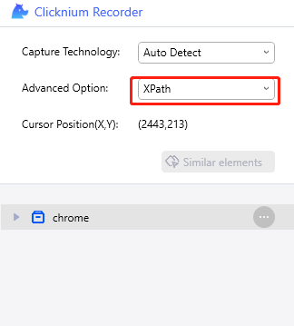
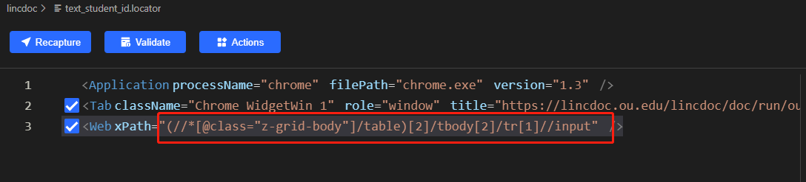
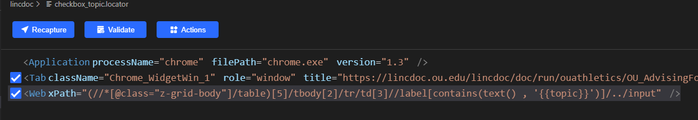

# Fill form using clicknium

As the id of the element of this form(https://lincdoc.ou.edu/lincdoc/doc/run/ouathletics/OU_AdvisingForm2#ldTimeoutUri) is dynamic, we can not identify the element by id, I use [clicknium](https://www.clicknium.com) to do this automation, recorde the element by xpath,



After view the form,find it is better to use the table as anchor.
for example, student_id locator is as the following:



For topic checkbox, as there are several items can be checked. So I wrote the locator as the following (using paramettric locator):


Then it is easy to use, for example, need check the first one, code as the following:
```python
tab.find_element(locator.chrome.lincdoc.checkbox_topic, {'topic':'Academic Contract'}).set_checkbox()
```

If I want to uncheckm, I can write the code as the following:
```python
tab.find_element(locator.chrome.lincdoc.checkbox_topic, {'topic':'Academic Contract'}).set_checkbox(check_type='uncheck')
```

Clicknium is really useful for me, start it from [visual studio extension](https://marketplace.visualstudio.com/items?itemName=ClickCorp.clicknium)