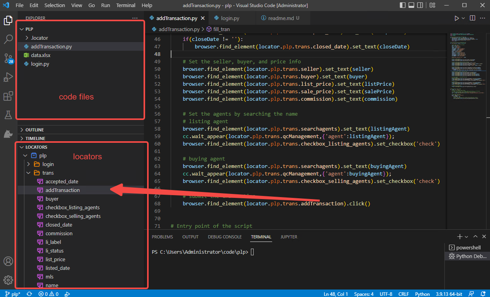

# Create Transaction with Excel Data

This sample contains code for automating login the app, and automating adding a transaction with data from Excel. 

- **Notice**: copy all files from the repo and open the folder with VSCode to run the sample. 

Before starting the sample, make sure you have:   
1. Installed [VSCode Clicknium Extension](https://marketplace.visualstudio.com/items?itemName=ClickCorp.clicknium);
2. Installed Clicknium python module;
3. Sign up and sign in the Clicknium extension.

## addTransaction.py
This script file focus on demonstrating adding a transaction record, so it requires the web site to be opened and login with a valid account prior running the script. (If you want to automate the login process, check the other script login.py)

This script reads data from excel, then fills data to transaction page. The Excel file data.xlsx contains two rows of sample data. 

## login.py
This script file demostrates automating login the web site. 