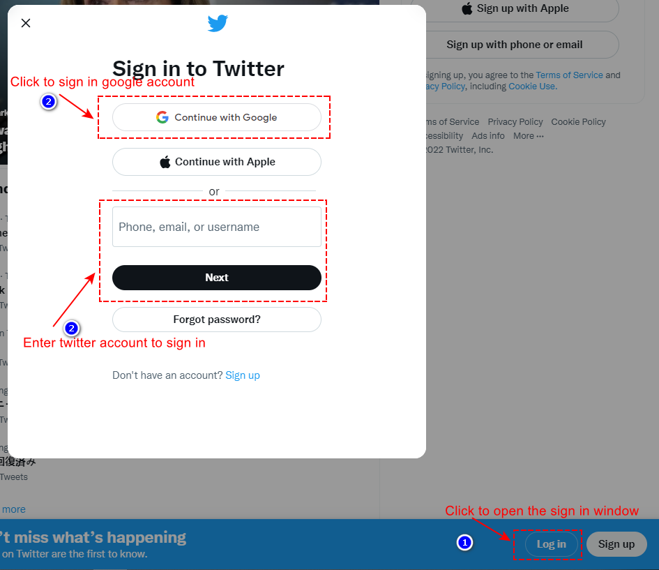
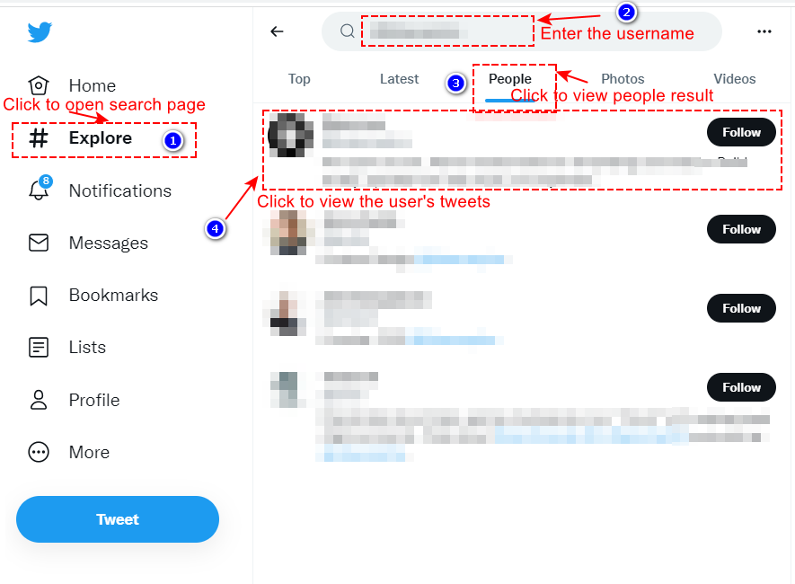
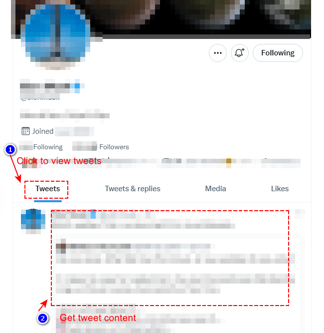
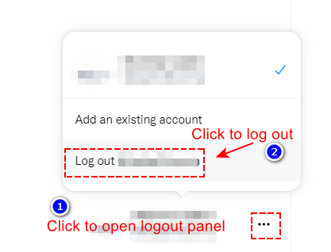
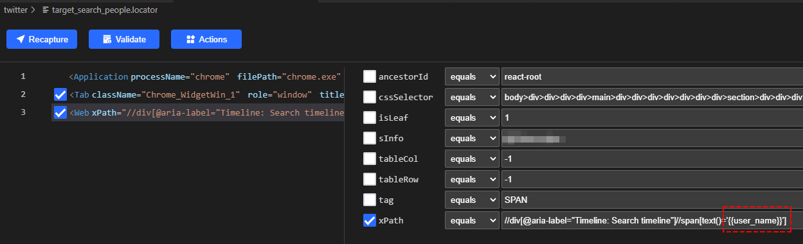

# Requirement Statements
Get someone's recent tweets and save to a CSV file.
We can start this simple beginner process quickly with [Clicknium](https://www.clicknium.com/).

# Environment Preparations
- Windows 10
- Visual Studio Code 1.69.2
- Clicknium 0.1.3
- Python 3.10.5
- Chrome 103.0.5060.134
> **Remarks:**  
>- Need run this sample in English region. 

# Run this sample
- Follow [clicknium getting started](https://www.clicknium.com/documents) to set up develop environment.
- Clone [sample repo](https://github.com/automation9417/automation-samples.git).
  ```
  git clone https://github.com/automation9417/automation-samples.git
  ```
- Open the folder 'ScrapingPeopleRecentTweets' in Visual Studio code
- Open `sample.py` in visual studio code.
- Fill the sign config in  `sample.py`
  ```python
    sign_in_method_name="" #google for Google account, twiiter_account for tweet account.
    account="" #google email/phone, twitter username/email/phone
    verify_account=""#Sign in with tweet account, may need secondary verification. e.g. sign in with twitter email use username/phone to verify.
    password="" # password
  ```
- Fill a Twitter user name you want to scrape Tweets from  in `sample.py`
  ```python
  scrape_user_name="" # The Twitter name you want to scrape Tweets from, must start with @. e.g. @exemple
  ```
- Press `F5` to debug the sample or press `CTRL+F5` to run sample.

# Steps

1. Assume Twitter is not open in chrome, so we need open chrome with the explore address firstly.  
   ```python
   #Use following code to open chrome with target url
   browser_tab=clicknium.chrome.open("https://twitter.com/explore") 
   ```
2. Assume Twitter is not signed in, so we need to sign in twitter with Google account or twitter account.  

  - Google account sign in
    ```python
    from time import sleep
    from clicknium import clicknium, locator
    from clicknium.common.enums import *
    def google_sign_in(email_or_phone,password):
        clicknium.find_element(locator.websites.twitter.login_btn).click()
        sleep(2)
        clicknium.send_hotkey("{ESC}")
        continue_with_google_btn=clicknium.wait_appear(locator.websites.twitter.continue_with_google_btn,wait_timeout=5)
        if continue_with_google_btn:
            continue_with_google_btn.click(by= MouseActionBy.MouseEmulation)
        else:
            clicknium.find_element(locator.websites.twitter.continue_as_x_btn).click(by= MouseActionBy.MouseEmulation)
            clicknium.find_element(locator.websites.google_accounts.use_other_account_btn).click()
        clicknium.find_element(locator.websites.google_accounts.email_or_phone_input).set_text(email_or_phone)
        clicknium.find_element(locator.websites.google_accounts.email_or_phone_next_btn).click()
        clicknium.find_element(locator.websites.google_accounts.password_input).set_text(password)
        clicknium.find_element(locator.websites.google_accounts.password_next_btn).click()
    ```
  - Twitter account sign in
    ```python
    from time import sleep
    from clicknium import clicknium, locator
    from clicknium.common.enums import *

    def sign_in_with_twitter_account(email_or_phone_or_username,verify_account,password):
        clicknium.find_element(locator.websites.twitter.login_btn).click()
        sleep(2)
        clicknium.send_hotkey("{ESC}")
        clicknium.find_element(locator.websites.twitter.twitter_account_input).set_text(email_or_phone_or_username)
        clicknium.find_element(locator.websites.twitter.login_next_btn).click()
        twitter_verify_input=clicknium.wait_appear(locator.websites.twitter.twitter_verify_input,wait_timeout=5)
        if twitter_verify_input:
            twitter_verify_input.set_text(verify_account)
            clicknium.find_element(locator.websites.twitter.login_next_btn).click()
        clicknium.find_element(locator.websites.twitter.twitter_password_input).set_text(password)
        clicknium.find_element(locator.websites.twitter.login_form_login_btn).click()
    ```    
3. Search and select a twitter user by username.  
   

    ```python
    from time import sleep
    from msilib.schema import Error
    from clicknium import clicknium, locator,ui
    from clicknium.common.enums import *
    import csv

    def search_and_select_user(username):
        clicknium.find_element(locator.websites.twitter.explore_menu).click()
        clicknium.find_element(locator.websites.twitter.search_text_box_input).click(by= MouseActionBy.MouseEmulation)
        clicknium.find_element(locator.websites.twitter.search_text_box_input).set_text(username)
        sleep(1)
        clicknium.send_hotkey('{ENTER}')
        
        search_people_tab=clicknium.wait_appear(locator.websites.twitter.search_people_tab,wait_timeout=10)
        if search_people_tab:
            search_people_tab.click()
        else:
            msg="Search people tab not found."
            raise Error(msg)
        
        target_search_people=clicknium.wait_appear(locator.websites.twitter.target_search_people,{"user_name":username}, wait_timeout=10)
        if target_search_people:
            target_search_people.click()
        else:
            msg="People:"+username+" not found."
            raise Error(msg)
    ```
4. Get user recent tweets.  
  
  - Use [get_text](https://www.clicknium.com/documents/references/python/uielement/get_text) to get the tweets publish date, content and link, the result will be saved to a CSV file.  
    ```python
    from time import sleep
    from msilib.schema import Error
    from clicknium import clicknium, locator,ui
    from clicknium.common.enums import *
    import csv


    def get_user_recent_tweets(username)->str:
        search_and_select_user(username)

        clicknium.find_element(locator.websites.twitter.user_tweets_tab).click()
        tweet_article=clicknium.wait_appear(locator.websites.twitter.tweet_article, wait_timeout=10)
        if not tweet_article:
            msg="Tweet not found."
            raise Error(msg) 
        
        ret_csv_file_name=username+'_recent_tweets.csv'
        with open(ret_csv_file_name, 'w', newline='',encoding='utf-8') as csvfile:
            fieldnames = ['publish_date',"content","link"]
            writer = csv.DictWriter(csvfile, fieldnames=fieldnames)
            writer.writeheader()

            tweet_articles=clicknium.find_elements(locator.websites.twitter.tweet_article)
            #Start for loop
            for index in range(1,tweet_articles.__len__()+1):
                selected_tweet_article=clicknium.wait_appear(locator.websites.twitter.selected_tweet_article,{"index":index},wait_timeout=5) 
                if not selected_tweet_article:      
                    continue
                tweet_text=clicknium.wait_appear(locator.websites.twitter.tweet_text,{"index":index},wait_timeout=2) 
                content=""
                if tweet_text:
                    content=tweet_text.get_text()

                tweet_card=clicknium.wait_appear(locator.websites.twitter.tweet_card,{"index":index},wait_timeout=2) 
                link=""
                if tweet_card:
                    link=tweet_card.get_property("href")
                
                tweet_publish_date=clicknium.wait_appear(locator.websites.twitter.tweet_publish_date,{"index":index},wait_timeout=2) 
                publish_time=""
                if tweet_publish_date:
                    publish_time=tweet_publish_date.get_property("datetime")
                
                writer.writerow({'publish_date':publish_time,"content":content,"link":link}) 
            #End for loop
    ``` 
5. Sign out.  
  
    ```python
    from clicknium import clicknium, locator

    def sign_out():
        user_avatar_btn=clicknium.wait_appear(locator.websites.app_slack.user_avatar_btn,wait_timeout=5)
        if user_avatar_btn:
            user_avatar_btn.click()
            clicknium.find_element(locator.websites.app_slack.sign_out_btn).click()
    ```
6. Close opened browser tab.  
   ```python  
   browser_tab.close()# close the opened browser tab.
   ``` 
# Tips 
- Pass variable to the locator  
In this sample user name is passed to the `target_search_people` locator as following
  - Define variable in locator  
     
  -  Pass variable in code
      ```python
      target_search_people=clicknium.wait_appear(locator.websites.twitter.target_search_people,{"user_name":username}, wait_timeout=10)
      ``` 
# Concepts  
[Clicknium](https://www.clicknium.com/) provides excellent ways of the recorder and the concept of the Locator, which helps you finish developing efficiently without lots of details. Hence it is worth getting to know the concepts below.
1. [Locator](https://www.clicknium.com/documents/concepts/locator)
2. [Recorder](https://www.clicknium.com/documents/tutorial/recorder/)  
> **Functions involved**
>- [click](https://www.clicknium.com/documents/references/python/uielement/click)
>- [set_text](https://www.clicknium.com/documents/references/python/uielement/set_text)
>- [get_text](https://www.clicknium.com/documents/references/python/uielement/get_text)
>- [open browser](https://www.clicknium.com/documents/references/python/webdriver/open)
>- [wait_appear](https://www.clicknium.com/documents/references/python/globalfunctions/wait_appear)
>- [activate browser tab](https://www.clicknium.com/documents/references/python/webdriver/browser/browsertab/activate)
>- [close browser tab](https://www.clicknium.com/documents/references/python/webdriver/browser/browsertab/close)
>- [find_element](https://www.clicknium.com/documents/references/python/webdriver/browser/browsertab/find_element)
>- [set_focus](https://www.clicknium.com/documents/references/python/uielement/set_focus)
>- [get_property](https://www.clicknium.com/documents/references/python/uielement/get_property)
>- [send_hotkey](https://www.clicknium.com/documents/references/python/uielement/send_hotkey)   
# Get Started
1. Create a new folder. Open Visual Studio Code and press the keyboard shortcut `Ctrl+Shift+P` to select [Clicknium: Sample](https://www.clicknium.com/documents/tutorial/vscode/project_management) and select the newly created folder.
2. pip install clicknium
3. Copy the '.locator' folder under 'ScrapingPeopleRecentTweets' to your new created folder
4. Open `sample.py` and follow the steps above