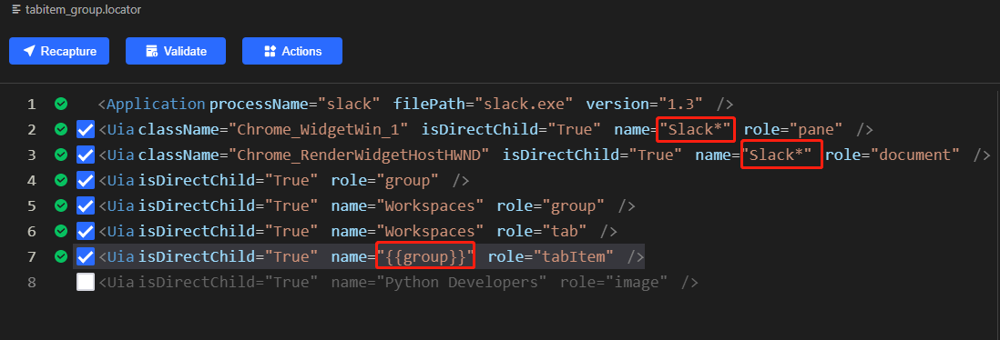
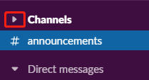
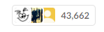
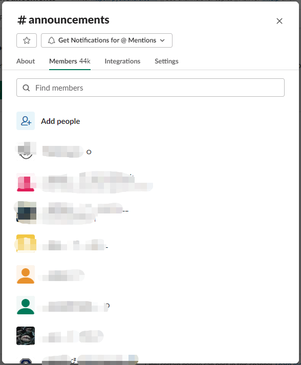
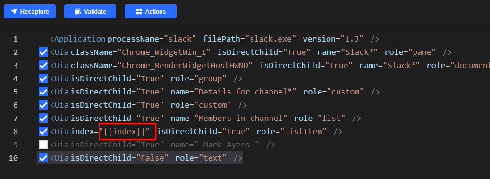
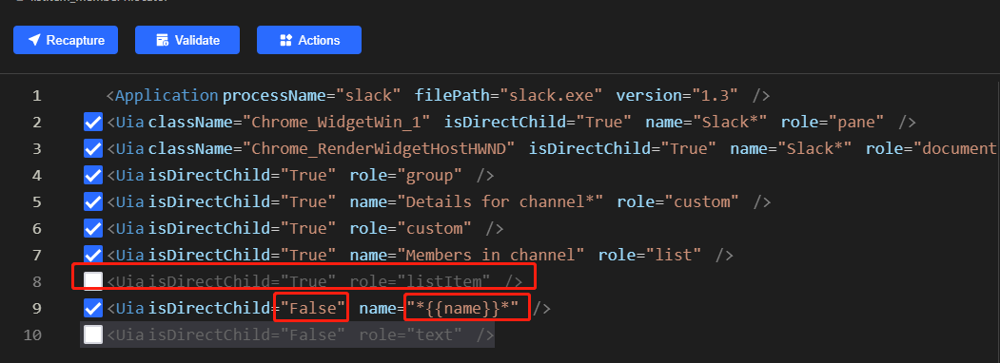

Slack Automation Sample - Scraping contact list from one channel

# Background
Recently, I need to monitor contact info of some slack channels, but I don't have API to invoke. So I need use UI Automation to finish this task.
I found this library recently [Clicknium](https://marketplace.visualstudio.com/items?itemName=ClickCorp.clicknium), besides support web automation like selenium, it also support desktop automation, that is useful for me.
You can follow the getting started of this Visual Studio Code extension to setup enviroment, less than 2 minutes for me.

# Slack client automation - Scraping the contact list
- Auto select group and channel.
based on group name, auto click on the left navigation bar:


I use [Clicknium Recorder](https://www.clicknium.com/documents/developtools/vscode/recorder/) to record the UI element on slack, and update it with parameter {{group}} as the following, for parametric locator, please refer to [Clicknium Document](https://www.clicknium.com/documents)



I set the title of the windows to 'Slack*', as clicknium support wild char to match, it can improve the automation robust.
And I add the tabitem name to parameter 'group', then I can sepecify group in running stage.

```python
from clicknium import clicknium as cc, locator, ui

ui(locator.slack.tabitem_group, {'group':group}).click()
```

- In similar way to auto click channel.
```python
if not cc.is_existing(locator.slack.treeitem_channel, params):
        ui(locator.slack.treeitem_parent).click()
    ui(locator.slack.treeitem_channel, params).click()
```
As sometimes channel list is collapsed, so I check the target channel is existing or not, if not, need click the Channels to elapse the channel list first.



- get the contact count by get the text of the info at the right-top, then parse the text.
  
```python
text = ui(locator.slack.text_all, params).get_text()
index = text.find("members")
count = int("".join(re.findall("\d+",text[0:index])))
```
- Show the contact list dialog by clicking the info at the right-top.
- 


- as the contact list is dynamic loaded, so we scrape almost 10 items, need page down the scroll bar to load new contacts
```python
for i in range(1,13):
    dict = {"index":i}
    if not cc.is_existing(locator.slack.listitem_member, dict):
        continue
    elem_member = ui(locator.slack.listitem_member, dict)
    name = elem_member.get_text()
    if NotContains(names, name):
        names.append({'name':name,'email':'', 'postfix':''})
        step += 1
        if step % 100 == 0:
            SaveToFile(names)

## move mouse down to trigger new data loaded for member list
ui(locator.slack.edit_membername).click(by='mouse-emulation')
for i in range(10):
    cc.send_hotkey("{DOWN}")
```

I click the find members edit box and then send the hotkey 'Down' for ten times, it will trigger to load new contacts.
To scrap each member name, I use the following parametric locator:




# Slack client automation - Scraping the contact detail
In above section, I show how to Scraping contact list from a channel, in this section, I show how to Scraping each contact detail information, such as email address. (If the channel don't show the email address, you can skip this section).

- Same as the above section to auto select group and channel.
- Show the contact list dialog by clicking the info at the right-top.
- Input the contact name to search the contact
```python
ui(locator.slack.text_all, params).click()
ui(locator.slack.edit_membername).set_text(item['name'], "set-text")
```
- If matched, click to show profile of the contact, and then get the text of email

To click the search result, I use the following locator,
set the name with parameter 'name' and uncheck listitem layer.



- Error handling in this section:
  - If search failed, need close the dialog and iterate to next contact.
  - If cannot get the email info, need close the profile tab and iterate to next contact.
```python
member1 = cc.wait_appear(locator.slack.listitem_member1, {'name':item['name']})
if member1 != None:
    member1.click()
else:
    print("failed to search the member")
    item['email'] = "ignore"
    item['postfix'] = ""
    ui(locator.slack.image).click()
    continue

try:
    email = ui(locator.slack.text_email).get_text(timeout=5)
    item['email'] = email
    item['postfix'] = email.split('@')[1]
except:
    print("failed to find the email")
    item['email'] = "ignore"
    item['postfix'] = ""
    if cc.is_existing(locator.slack.image):
        ui(locator.slack.image).click()
        continue
```

# Open Source Code
I put the code in my github, if you need view full code, please refer to [github]().