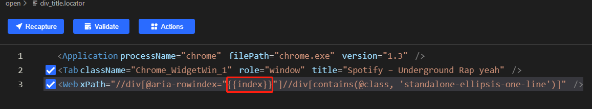
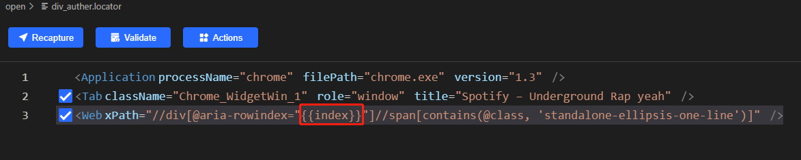

# scraping list from spotify using clicknium

As the list is dynamic loaded, I use iterate index to search each item, as [clicknium](https://www.clicknium.com) can automatically scroll to the item, it will trigger to load new items.


I use parametric locator for title and auther





As one item may has multiple authors, so I use the following code to get multiple author's name and link:
```python
    element = tab.find_element(locator.chrome.open.div_auther, {'index':index})
    authers = element.children
    for item in element.children:
        artist.append(item.get_text())
        link.append(item.get_property('href'))
```
