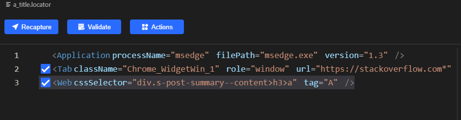

# Automatically scrape a list of stack overflow questions

Recently following questions on stack overflow of certain tag or searching keywords, So I want to write automation python program to help me do monitoring, automatically open the browser, search for the specified keyword, and then save or send me the list of the first 30 questions.

The source code can be obtained from[github](https://github.com/automation9417/automation-samples/tree/main/StackOverflow), and the following is my development process.

## Development environment
- windows 10
- python 3.0
- [clicknium](https://www.clicknium.com)

Install clicknium vscode extension，please refer to [getting started](https://marketplace.visualstudio.com/items?itemName=ClickCorp.clicknium).

## Development idea
- Automatically open the browser and return the tab object.
```python
tab = cc.edge.open("www.stackoverflow.com")
```
- Enter a keyword and send the {ENTER} key to search.
```python
tab.find_element(locator.stackoverflow.text_q).set_text(word)
tab.find_element(locator.stackoverflow.text_q).send_hotkey('{ENTER}')
```
- Before searching, man-machine verification may be required, and the following code is used to judge and click.
```python
elem = tab.wait_appear(locator.stackoverflow.human_verification_div, wait_timeout=5)
if elem != None:
    elem.click()
```

- Click 'Newest' to sort by time.

- Use clicknium `find_elements` to get the title of each question, the number of votes, the content, the last update time, and the url of the question.
```python
    while catch_count < 30:
        sleep(1)
        elems_title = tab.find_elements(locator.stackoverflow.a_title)
        elems_vote = tab.find_elements(locator.stackoverflow.span_vote)
        elems_content = tab.find_elements(locator.stackoverflow.div_content)
        elems_time = tab.find_elements(locator.stackoverflow.span_time)
        for i in range(len(elems_title)):
            url = "https://www.stackoverflow.com" + elems_title[i].get_property('href')
            item = {
                'Keyword':word, 
                'Title': elems_title[i].get_text(), 
                'Content': elems_content[i].get_text(),
                'Time': elems_time[i].get_text(),
                'Vote': elems_vote[i].get_text(),
                'Url':url}
            print(item)
            catch_count += 1
        if tab.is_existing(locator.stackoverflow.a_next):
            tab.find_element(locator.stackoverflow.a_next).click()
        else:
            break
```
Here is the locator for the question title element


Through `find_elements`, you can get the list of all elements at one time, and then get the text through `get_text()`. For links, you can also get the attribute href through `get_property('href')`.


