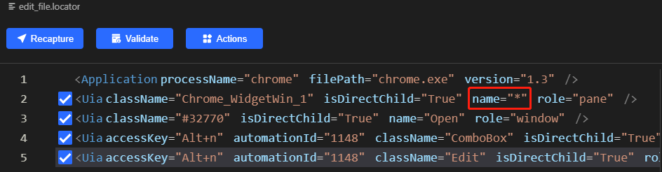

# Only 10 lines of python code to upload video to TikTok, Instagram, Twitter

First, let's look at the running video.

[upload video to Tiktok, Instagram, Twitter](https://github.com/automation9417/automation-samples/raw/main/UploadVideo/media/upload_video.mp4)

## Material Prepared
An mp4 video file, because twitter has a limit on the length of uploaded videos, a shortened video file has been prepared.
A cover image for Instagram, TikTok uses the first frame of the video as cover.


## Run Python Code
- follow [clicknium getting started](https://www.clicknium.com/documents/quickstart) to set up develop environment.
- clone [sample repo](https://github.com/automation9417/automation-samples).
```
git clone https://github.com/automation9417/automation-samples.git
```
- open the folder 'UploadVideo' in Visual Studio Code.
- open `sample.py` in Visual Studio Code.
- open the chrome browser (guarantee that there is only one chrome window, explained later), open 3 tabs respectively, open and login TikTok, Twitter and Instagram.
- press `F5` to debug the sample or press `CTRL+F5` to run sample.
The video that comes with the sample will be uploaded, and you can also modify code to your own video content:
```python
caption = 'Clicknium introduction'
cover_image = os.path.join(os.getcwd(), "media", "logo.png")
video_file = os.path.join(os.getcwd(), "media", "clicknium_introduction.mp4")
upload_tiktok.upload(caption, video_file)
short_video_file = os.path.join(os.getcwd(), "media", "short_introduction.mp4")
upload_twitter.upload(caption, short_video_file)
upload_instagram.upload(caption, cover_image, video_file)
```

## Implementation
Here is an example of uploading a video to Instagram, uploading a video to TikTok and Twitter is a similar process.

- Get the open browser tab by attaching the browser, and then navigate to the Instagram Home page.
```python
tab = cc.chrome.attach_by_title_url(url="https://*instagram.com/*")
tab.goto("https://www.instagram.com/")
```
- Click the 'add post' button, all web page elements here are recorded by [Clicknium Recorder](https://www.clicknium.com/documents/tutorial/recorder/quickstart).
```python
tab.find_element(locator.chrome.instagram.svg_add_post).click()
```
- Click the 'Select from computer' button to pop up a file selection dialog box. Due to browser security restrictions, click here by simulating a mouse.
```python
tab.find_element(locator.chrome.instagram.button_select_file).click(by='mouse-emulation')
```

- Using Clicknium desktop automation to select video file and click open button.
```python
ui(locator.chrome.edit_file).set_text(video_file, by='set-text')
ui(locator.chrome.button_open).click(by='control-invocation')
```
A special note here is that I changed the recorded locator 'edit_file' and 'button_open':



Changed the window matching Name to the wildcard *, because uploading videos to TikTok and Twitter also requires the operation of the file selection dialog. In order to avoid repeated recording, the wildcard is used to match the window to achieve reuse. Therefore, the previous steps require only one Chrome browser window to ensure that the window can be correctly matched.

- Click the 'next' button, then select the cover image, the code is similar to the above.
- Enter the text you want to send, then click 'Share' button.
```python
tab.find_element(locator.chrome.instagram.textarea).set_text(caption)
tab.find_element(locator.chrome.instagram.button_share).click()
```
- Wait for the upload to succeed, the time required varies according to the size of the video.
```python
tab.wait_appear(locator.chrome.instagram.h2_yourposthasbeenshared, wait_timeout=120)
```

Uploading a video to Instagram requires a few more steps to upload a cover image. The following is the complete code for uploading a video to Twitter. It only takes 9 lines of code.

```python
tab = cc.chrome.attach_by_title_url(url="https://*twitter.com/*")
tab.goto("https://twitter.com/compose/tweet")
tab.find_element(locator.chrome.twitter.div).set_focus()
cc.send_text(tweet)
tab.find_element(locator.chrome.twitter.svg).click()
ui(locator.chrome.edit_file).set_text(video_file, by='set-text')
ui(locator.chrome.button_open).click(by='control-invocation')
tab.wait_appear(locator.chrome.twitter.video)
tab.find_element(locator.chrome.twitter.span_tweet).click()
```

You are welcome to comment on the needs of uploading videos to other video platforms, and I can provide more sample code.
