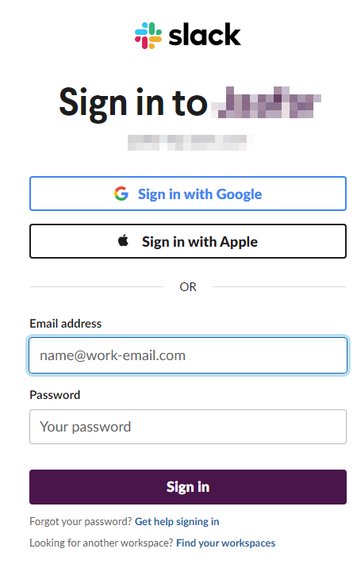
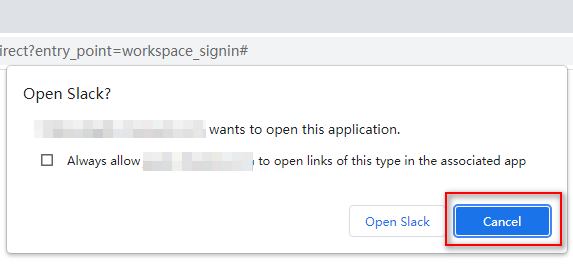
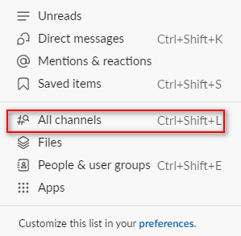
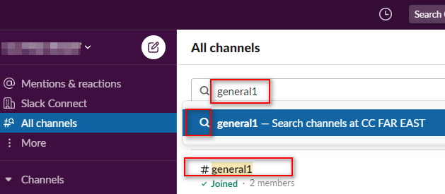
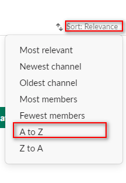
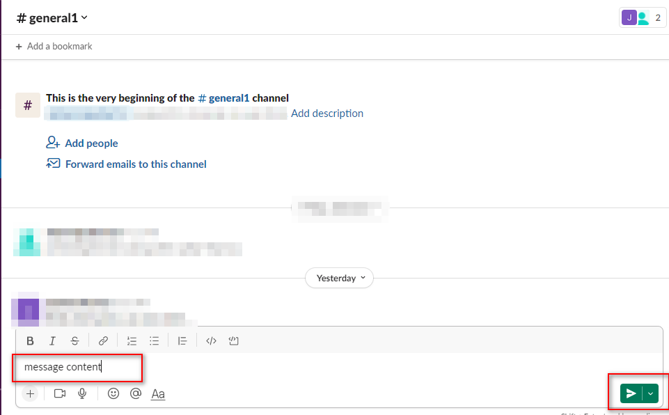
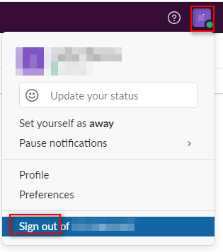
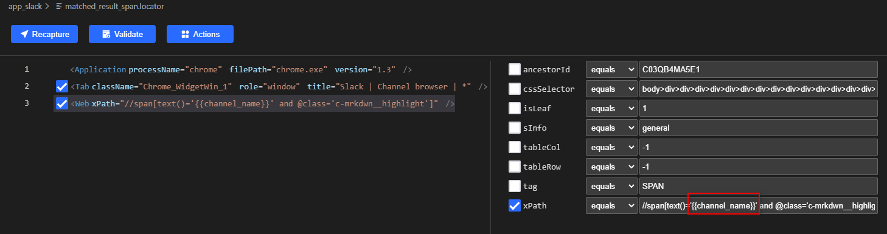
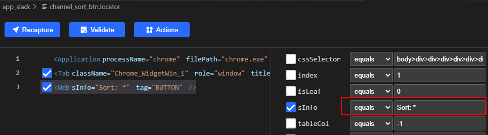

# Requirement Statements
Send a message to a slack community's channel.
We can start this simple beginner process quickly with [Clicknium](https://www.clicknium.com/).

# Environment Preparations
- Windows 10
- Visual Studio Code 1.69.2
- Clicknium 0.1.2
- Python 3.10.5
- Chrome 103.0.5060.134
- Python package pyperclip
> **Remarks:**  
>- Need run this sample in English region. 

# Run this sample
- Follow [clicknium getting started](https://www.clicknium.com/documents) to set up develop environment.
- Clone [sample repo](https://github.com/automation9417/automation-samples.git).
  ```
  git clone https://github.com/automation9417/automation-samples.git
  ```
- Open the folder 'WebSlackSendMessage' in Visual Studio code
- Open `sample.py` in visual studio code.
- Fill the sign config in  `sample.py`
  ```python
  sign_method_name="" #google for Google account, slack_email for slack email.
  sign_in_email_or_phone="" #google email or slack email
  sign_in_password="" #account passwword
  ```
- Fill the slack config in `main.py`
  ```python
  slack_community_url="" #The URL of the slack community you want to send essage. e.g."https://example.slack.com"
  slack_channel_name="" #The name of the channel you want to send message.
  slack_message="" #The message content
  ```
- Press `F5` to debug the sample or press `CTRL+F5` to run sample.

# Steps

1. Assume Slack is not open in chrome, so we need open chrome with the community address firstly.  
   ```python
   #Use following code to open chrome with target url
   browser_tab=clicknium.chrome.open("https://example.slack.com") # update the address to your slack community.
   ```
2. Assume Slack is not signed in, so we need to sign in slack with Google account or Slack account.  

  - Google account sign in
    ```python
    from msilib.schema import Error
    from clicknium import clicknium, locator
    def google_sign_in(email,password):
        clicknium.find_element(locator.websites.slack.google_sign_in_btn).click()
        choose_account_lebel=clicknium.wait_appear(locator.websites.google_account.choose_account_label,wait_timeout=5)
        if choose_account_lebel:
            clicknium.find_element(locator.websites.google_account.use_another_account_btn).click()
        email_or_phone_input=clicknium.wait_appear(locator.websites.google_account.email_or_phone_input,wait_timeout=5)
        if email_or_phone_input:
            email_or_phone_input.set_text(email)
        else:
            error_msg="email_or_phone_input not found."
            raise Error(error_msg)
        clicknium.find_element(locator.websites.google_account.email_or_phone_next_btn).click()
        password_input=clicknium.wait_appear(locator.websites.google_account.password_input,wait_timeout=5)
        if password_input:
            password_input.set_text(password)
        else:
            error_msg="password_input not found."
            raise Error(error_msg)
        clicknium.find_element(locator.websites.google_account.password_next_btn).click()
    ```
  - Slack account sign in
    ```python
    from clicknium import clicknium, locator

    def slack_email_sign_in(email,password):
        clicknium.find_element(locator.websites.slack.slack_email_input).set_text(email)
        clicknium.find_element(locator.websites.slack.slack_password_input).set_text(password)
        clicknium.find_element(locator.websites.slack.slack_signin_btn).click()
    ```
3. Cancel open slack desktop app  

  - Click `Cancel` button
      ```python
      from clicknium import clicknium, locator
      from clicknium.common.enums import *
      def close_open_desk():
          open_slack_cancel_btn= clicknium.wait_appear(locator.desktops.chrome.open_slack_win_cancel_btn,wait_timeout=10)  
          if open_slack_cancel_btn:
              open_slack_cancel_btn.click(by=MouseActionBy.MouseEmulation) 
      ```
4. Choose use slack in browser  
  
  - Click `use Slack in your browser`
      ```python
      from clicknium import clicknium, locator
      def use_slack_in_browser():
          use_slack_in_browser_button=clicknium.wait_appear(locator.websites.slack.use_slack_in_browser_button,wait_timeout=5)      
          if btn:
              use_slack_in_browser_button.click()
      ```    
5. Open search channel page.  
  
  - Send hot key `Ctrl+Shift+L` to open search change page
    ```python
    def browse_channels():
        channels_menu_inner_span=clicknium.wait_appear(locator.websites.app_slack.channels_menu_inner_span,wait_timeout=5) 
        if channels_menu_inner_span:
            clicknium.send_hotkey("{CTRL}{SHIFT}L")
            sleep(1)
        else:
            msg="channels menu not found."
            raise Error(msg)
    ``` 
6. Search and select the target channel.  
  
  - Enter the target channel name  
  - Click the `Search` icon  
  - Choose sort `A to Z`  
    

  - Select the target channel  
    ```python
    from msilib.schema import Error
    from clicknium import clicknium, locator
    def search_and_select_channel(channel_name):
        clicknium.find_element(locator.websites.app_slack.search_channel_tbx).set_text(channel_name)
        clicknium.find_element(locator.websites.app_slack.search_channel_btn).click()
        clicknium.find_element(locator.websites.app_slack.channel_sort_btn).click()
        clicknium.find_element(locator.websites.app_slack.sort_atoz_btn).click()
        matched_result_span=clicknium.wait_appear(locator.websites.app_slack.matched_result_span,{"channel_name": channel_name})
        if matched_result_span:
            matched_result_span.click()
        else:
            msg="No matched channel for "+channel_name
            raise Error(msg)
    ```
7. Enter the message and send.  
  
  - Enter message
  - Click the `Send` icon
    ```python
    from clicknium import clicknium, locator
    import pyperclip

    def send_message(channel_name, message):
        navigate_to_browser_channel_page()
        search_and_select_channel(channel_name)
        clicknium.find_element(locator.websites.app_slack.channel_message_input).set_focus()
        clicknium.send_hotkey('{CTRL}A')
        clicknium.send_hotkey('{CTRL}X')
        pyperclip.copy(message)
        clicknium.send_hotkey('{CTRL}V')
        clicknium.find_element(locator.websites.app_slack.send_message_btn).click()
    ```
8. Sign out.  
  
  - Click user avatar
  - Click `Sign out` 
    ```python
    from clicknium import clicknium, locator

    def sign_out():
        user_avatar_btn=clicknium.wait_appear(locator.websites.app_slack.user_avatar_btn,wait_timeout=5)
        if user_avatar_btn:
            user_avatar_btn.click()
            clicknium.find_element(locator.websites.app_slack.sign_out_btn).click()
    ```
9. Close opened browser tab.  
   ```python  
   browser_tab.close()# close the opened browser tab.
   ``` 
# Tips 
- Pass variable to the locator  
In this sample channel name is passed to the `matched_result_span` locator as following
  - Define variable in locator  
     
  -  Pass variable in code
      ```python
      matched_result_span=clicknium.wait_appear(locator.websites.app_slack.matched_result_span,{"channel_name": channel_name})
      ```
- Use wildcard in locator  
In this sample `channel_sort_btn` locator's sInfo is updated end with * as following
  
# Concepts  
[Clicknium](https://www.clicknium.com/) provides excellent ways of the recorder and the concept of the Locator, which helps you finish developing efficiently without lots of details. Hence it is worth getting to know the concepts below.
1. [Locator](https://www.clicknium.com/documents/automation/locator)
2. [Recorder](https://www.clicknium.com/documents/developtools/vscode/recorder/)  
> **Functions involved**
>- [click](https://www.clicknium.com/documents/api/python/uielement/click)
>- [set_text](https://www.clicknium.com/documents/api/python/uielement/set_text)
>- [open browser](https://www.clicknium.com/documents/api/python/webdriver/open)
>- [wait_appear](https://www.clicknium.com/documents/api/python/globalfunctions/wait_appear)
>- [activate browser tab](https://www.clicknium.com/documents/api/python/webdriver/browser/browsertab/activate)
>- [close browser tab](https://www.clicknium.com/documents/api/python/webdriver/browser/browsertab/close)
>- [find_element](https://www.clicknium.com/documents/api/python/globalfunctions/find_element)
>- [set_focus](https://www.clicknium.com/documents/api/python/uielement/set_focus)
>- [get_property](https://www.clicknium.com/documents/api/python/uielement/get_property)
>- [send_hotkey](https://www.clicknium.com/documents/api/python/globalfunctions/send_hotkey)  
# Get Started
1. Create a new folder. Open Visual Studio Code and press the keyboard shortcut `Ctrl+Shift+P` to select [Clicknium: Sample](https://www.clicknium.com/documents/developtools/vscode/project_management) and select the newly created folder.
2. pip install clicknium
3. pip install pyperclip
4. Copy the '.locator' folder under 'WebSlackSendMessage' to your new created folder
5. Open `sample.py` and follow the steps above